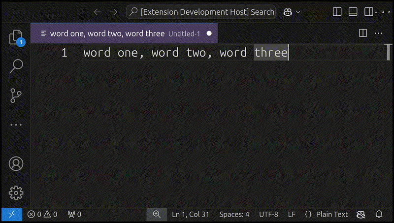

# Hashtagify VS Code Extension

Adds a command that turns the selected text into a sequence of hashtags, for example:

* word one, word two, word three -> #WordOne #WordTwo #WordThree
* one two three -> #One #Two #Three

## Demo

## Test and Publish the Extension

1. Press `F5` in VS Code to run the extension in a new Extension Development Host window.
2. Open a file in the new development environment, select a string of words (e.g., `geo map, urban art`).
3. Press `Ctrl + Shift + P` (or `Cmd + Shift + P` on Mac) to open the command palette.
4. Run the command by searching for `Hashtagify Word List`.
5. The selected text should transform into hashtags (e.g., `#GeoMap #UrbanArt`).
6. Package the extension into a `.vsix` file: `vsce package`
7. Upload to https://marketplace.visualstudio.com/manage/
